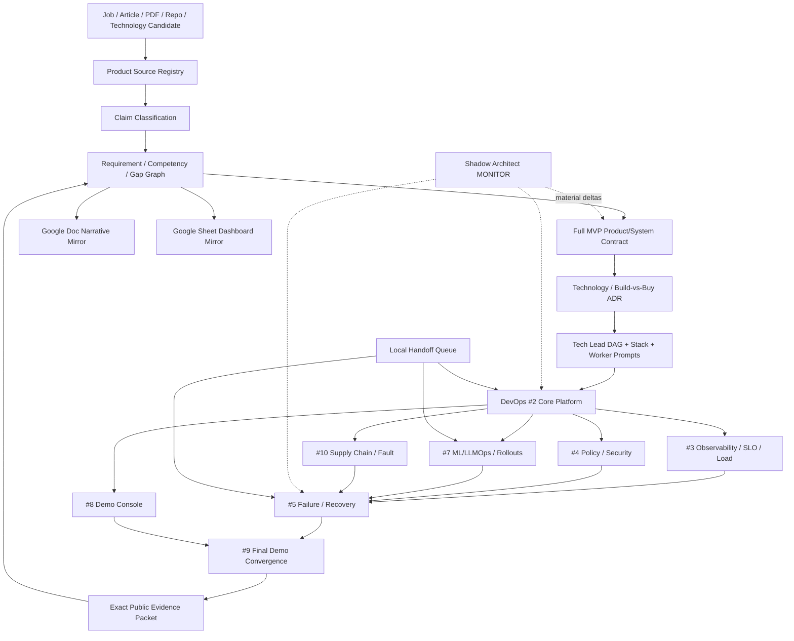

# Product Manager Notes

Public **management and routing center** for the Full Manager MVP Demo and Technical Product Manager evidence program.

This repository compiles job descriptions, articles, PDFs, repositories and technology candidates into a traceable Manager Evidence Graph. `DevOps-Manager-Notes` is the public executable evidence plane; `skills-shared` owns reusable Tech Lead / Shadow Architect / Git Town methods. Google Docs/Sheets are human projections only.

## Public disclosure boundary

GitHub repository metadata is the visibility source of truth. This repository is currently public. Therefore all tracked content must be safe for public disclosure: never commit credentials, customer/user private data, employer-confidential material, private source documents, private prompts containing sensitive context, or unredacted evidence. A public URL or public GitHub state does not widen the evidence ceiling of any claim.

Repository visibility, permission changes, merge, release and real-experience admission remain Human-owned. See `docs/PUBLIC_DISCLOSURE_CHECKLIST.md` before P7 export.

## Control-plane ownership

```text
skills-shared
  reusable Tech Lead / Shadow Architect / Git Town procedures
       ↓
Product-Manager-Notes                     ← canonical Manager/router state (public-safe only)
  sources / claims / requirements / gaps / product decisions / prompts / DAG
       ↓ public-safe evidence requests
DevOps-Manager-Notes                      ← public executable evidence
  app / CI / K8s / ML/LLMOps / SLO / security / failure / receipts
       ↓ exact evidence subjects
Product-Manager-Notes
  competency closure / interview narrative / export routing
       ├─ Google Sheet dashboard mirror
       └─ Google Doc narrative mirror
```

## Eight-stage execution program

| Stage | State transition | Main owner | Parallel work | Completion output |
|---|---|---|---|---|
| P0 Subject & authority | `REQUEST_BOUND → SUBJECT_ADMITTED` | control-plane owner | no | exact repo/branch/commit/issue, authority, evidence ceiling |
| P1 Source & evidence | `SUBJECT_ADMITTED → CONTEXT_ADMITTED` | evidence workers | article/PDF, GitHub, technology/license sources | source/claim/evidence/gap graph |
| P2 Real-problem closure & System Design | `CONTEXT_ADMITTED → SYSTEM_CONTRACT_EXTRACTED` | Product + DevOps architects | product and reliability lanes | PRD/case, invariants, state machines, failure matrix |
| P3 Technology & ADR | `SYSTEM_CONTRACT_EXTRACTED → ARCHITECTURE_ADMITTED` | architecture workers | candidate families | selected/rejected stack, license/ops/lock-in constraints |
| P4 Tech Lead DAG & Stack | `ARCHITECTURE_ADMITTED → WORKERS_ADMITTED` | Tech Lead | task-packet compilation | start/completion DAG, leases, molecular Stack, Worker prompts |
| P5 Parallel implementation | `WORKERS_ADMITTED → FIRST_GREEN` | bounded DevOps Workers | path-disjoint leaves | code/tests/receipts/draft PRs |
| P6 Runtime/failure proof | `FIRST_GREEN → REVERIFIED` | Shadow + runtime owners | load/fault/canary/policy probes | rollback/recovery/postmortem/same-failure re-test evidence |
| P7 Convergence/export/handoff | `REVERIFIED → INTERVIEW_READY / READY_FOR_HUMAN_ADMIT` | one convergence owner | non-authoritative Google projection after canonical closure | indexes, public-safe narrative, Local Handoff residuals |

`FIRST_GREEN` is a mandatory Shadow checkpoint, never terminal closure.

## Manager state machine

```text
SOURCE_BOUND
→ REQUIREMENT_EXTRACTED
→ COMPETENCY_MAPPED
→ CASE_MODELED
→ DECISION_LOGGED
→ IMPLEMENTATION_EVIDENCE_LINKED
→ FAILURE_EXERCISED
→ CLOSURE_EVIDENCE_BOUND
→ INTERVIEW_READY

stale / contradicted / wrong-subject evidence
→ GAP_REOPENED
```

## Repository topology

```text
Product-Manager-Notes/
├── README.md
├── AGENTS.md
├── roles/technical-product-manager/
│   ├── job-contract.yaml
│   ├── competency-matrix.yaml
│   ├── system-design/
│   ├── product/
│   ├── failures/
│   └── interviews/
├── registry/
│   ├── sources.yaml
│   ├── claims.yaml
│   ├── evidence.yaml
│   ├── gaps.yaml
│   ├── external-links.yaml
│   └── stack-plan.yaml
├── docs/
│   ├── INDEX.md
│   ├── PUBLIC_DISCLOSURE_CHECKLIST.md
│   ├── architecture/
│   │   ├── MANAGER_EVIDENCE_GRAPH.md
│   │   └── REPO_INTEGRATION_MAP.md
│   ├── case-studies/
│   │   └── INTERNAL_AI_PLATFORM_MVP_DEMO.md
│   └── decisions/
└── prompts/
    ├── README.md
    ├── stage-0-subject-authority.md
    ├── stage-1-source-evidence.md
    ├── stage-2-problem-closure-system-design.md
    ├── stage-3-technology-adr.md
    ├── stage-4-tech-lead-stack-plan.md
    ├── stage-5-parallel-implementation.md
    ├── stage-6-shadow-runtime-failure.md
    ├── stage-7-convergence-handoff.md
    └── full-mvp-devops-router.md
```

Directories are introduced only with real artifacts; path presence is not evidence.

## Directory → State Machine → DAG ownership

| Surface | State responsibility | Consumes | Produces / next owner | Evidence ceiling |
|---|---|---|---|---|
| `registry/sources.yaml` | source → stable identity | Job/Article/PDF/Repo/URL | classified claims | source/reachability |
| `registry/claims.yaml` | claim → type/owner/falsifier | source IDs | requirement/assumption/unknown | classification only |
| `roles/technical-product-manager/` | requirement → product/system case → interview obligation | claims + evidence | product decisions / evidence requests | design until executable evidence binds |
| `docs/case-studies/INTERNAL_AI_PLATFORM_MVP_DEMO.md` | target-role requirement → Full MVP user journey / acceptance | job contract + selected stack | public evidence contracts → DevOps | design only |
| `registry/evidence.yaml` | exact subject → lane → verdict | DevOps/public receipts | competency closure / gap reopen | exact named lane |
| `registry/gaps.yaml` | missing proof → owner issue | requirements + evidence | next task contract | no capability proof |
| `registry/stack-plan.yaml` | issue → molecular atom → branch/lease relation | Tech Lead contracts | PR topology / convergence | workflow only |
| `prompts/` | frozen stage/task → zero-context session packet | exact subject + task DAG | separate ChatGPT/Agent work | instruction only |
| `registry/external-links.yaml` | GitHub canonical state → Google projection | admitted GitHub state | Doc/Sheet mirror | URL reachability only |
| GitHub Issues/PRs | obligation → task/delivery subject | gap/Stack node | implementation/evidence owner | workflow/publication only |

## Full Manager MVP data flow



## Product + DevOps completion DAG

```text
Product PR #5 bootstrap Manager Evidence Graph
└─ Product PR #8 / issues #6,#7 Full MVP product + technology acceptance contract
   ├─ Product #1 exact competency evidence audit
   ├─ Product #2 flagship product/system-design case
   └─ Product #3 failure/decision/interview library
       ↓ exact public DevOps receipts
     Product #4 final Manager/interview convergence

DevOps PR #6 bootstrap execution contract
└─ DevOps PR #12 / #11 Full MVP technology + routing contract
   └─ #1 invariant/evidence audit
      └─ #2 core platform
         ├─ #3 observability/load        → PR #36 remote FIRST_GREEN
         ├─ #4 policy/security          → PR #38 remote FIRST_GREEN
         ├─ #7 ML/LLMOps/progressive    → PR #39 remote FIRST_GREEN
         ├─ #8 Demo Console             → PR #37 remote FIRST_GREEN
         └─ #10 supply-chain/fault      → PR #40 remote FIRST_GREEN
              ↓ exact side-input receipts
            #5 failure/recovery
              ↓ + #8
            #9 full reviewer convergence
```

Product #4 cannot close before the final public DevOps evidence subjects are admitted. DevOps #9 cannot manufacture employment/management tenure; those remain outside repository proof.

## Molecular Git Town Stack

`registry/stack-plan.yaml` is canonical. Product-side plan:

```text
C0  PR #5  Manager Evidence Graph bootstrap                  ROOT
└─ C6 PR #8  Full Manager MVP acceptance / technology ADR    TRUE_CHILD
   ├─ E1 #1 exact competency evidence audit                  sibling/process leaf after contract
   ├─ D2 #2 flagship product/system-design                   sibling
   └─ E3 #3 failure/decision/interview library               sibling
           ↓ public DevOps #9 evidence + verified Product artifacts
       X4 #4 Manager/interview convergence                   CONVERGENCE
```

A true child exists only for real unmerged-byte/contract consumption. Path-disjoint work remains sibling. Multi-input convergence has one mutable owner and consumes other prerequisites as exact verified side inputs.

## Separate ChatGPT session model

The P0–P7 prompt pack is the stage-level router. After Product P4 freezes a DevOps task contract, the actual implementation fan-out uses the zero-context prompt pack in `ed3c/DevOps-Manager-Notes/prompts/` for #1/#2/#3/#4/#7/#8/#10/#5/#9.

Every session binds:

```text
repo / branch / commit / tree / issue
goal / non-goals
allowed / read-only / forbidden paths
start dependencies / completion dependencies
consumed / produced artifacts
invariants / negative controls
evidence state / ceiling
Shadow deltas / stop conditions
Local Handoff boundary
Human-owned operations
next prompt / stage
```

Do not rely on chat memory to infer missing subjects.

## Repository integrations

```text
mandatory:
  Product-Manager-Notes  public-safe Manager/router state
  DevOps-Manager-Notes   executable public proof
  skills-shared          reusable method plane

trigger-selected:
  truth-verify-loop          mutable/high-risk external claim verification
  openwiki-source-anchoring exact source/path/quote verification
  runtime-env               secret-free local/provider runtime contracts
  skill-resume-site         P7 public portfolio export after evidence admission
  ai-content-notes / ai-product-notes source candidates only when material is public-safe
```

No support repository becomes a second Manager state authority.

## Google / GitHub routing

GitHub is canonical for source IDs, requirements, decisions, issues, PRs, Stack state and evidence receipts.

Human projections:

- Google Sheet: `https://docs.google.com/spreadsheets/d/18W2xpge7ZgA4WHJd1wsbMOuC5vgCsskCwYeDYPG-twQ/edit`
- Google Doc: `https://docs.google.com/document/d/10qgxR5TxYiZG55cY9wN9ANrkmG_o32vBVrSdd45fgRM/edit`

Google URLs are typed edges in `registry/external-links.yaml`; a URL proves reachability only and cannot promote evidence. Public GitHub documents must not mirror sensitive material from private/non-public sources.

## Automation boundary

The pipeline can highly automate source/claim intake, requirement mapping, prompt/task compilation, bounded repository changes, tests/CI, Stack preparation, receipt aggregation and Google projection. Physical local runtimes use the typed Local Handoff Queue. Merge/release, semantic conflict, production promotion/rollback, permissions/visibility and real-experience claims remain Human/trusted-owner operations.

## Current Shadow closure

```text
Manager/router bootstrap             PASS_AS_DESIGN       PR #5
Full MVP Product contract            PASS_AS_DESIGN       PR #8 / #6,#7
Product evidence audit               COMPLETE_STAGE       PR #9
DevOps invariant/evidence audit      COMPLETE_STAGE       PR #13
core remote FIRST_GREEN              PASS_BOUNDED         PR #14
public remote fan-out M2             PASS_BOUNDED         PR #36/#38/#39/#37/#40
live kind/Kubernetes                 NOT_EXERCISED        Local Handoff
local model/llama.cpp                NOT_EXERCISED        Local Handoff/future runner
live Argo Rollouts canary            NOT_EXERCISED        Local Handoff/future runner
failure/recovery convergence         NOT_IMPLEMENTED      DevOps #5
full reviewer convergence            NOT_IMPLEMENTED      DevOps #9
interview-ready convergence          NOT_IMPLEMENTED      Product #4
production/management tenure         OUTSIDE_REPO_PROOF   Human evidence only
```

The next legal frontier after the public remote fan-out milestone is local-substrate evidence where required plus DevOps #5 failure/recovery convergence. Remote FIRST_GREEN receipts do not promote those states.
