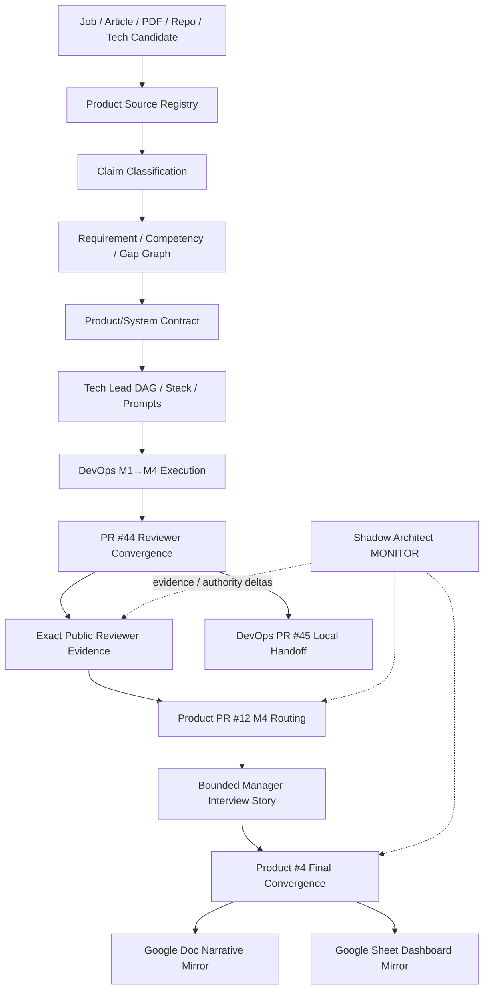

# Product Manager Notes

Public **management and routing center** for the Full Manager MVP Demo and Technical Product Manager evidence program.

This repository compiles job descriptions, articles, PDFs, repositories and technology candidates into a traceable Manager Evidence Graph. `DevOps-Manager-Notes` is the public executable evidence plane; `skills-shared` owns reusable Tech Lead / Shadow Architect / Git Town procedures. Google Docs/Sheets are human projections only.

## Public disclosure boundary

GitHub repository metadata is the visibility source of truth. This repository is public-safe only: never commit credentials, customer/user private data, employer/client confidential material, private source documents, sensitive prompts, or unredacted evidence. Public reachability does not widen any evidence ceiling.

Repository visibility/permissions, merge, release and real-experience admission remain Human-owned. Read `docs/PUBLIC_DISCLOSURE_CHECKLIST.md` before public export.

## Current public routing checkpoint

```text
Product bootstrap / contract         PASS_AS_DESIGN
Product existing evidence audit      COMPLETE_STAGE       PR #9
Public disclosure alignment          PASS_AS_POLICY       PR #11
DevOps M1→M4 executable evidence     PASS_BOUNDED
Public Manager M4 routing            PASS_BOUNDED_AS_ROUTING  PR #12
Product issue #4 final convergence   OPEN
```

Canonical M4 Product artifacts:

```text
docs/milestones/PUBLIC_MANAGER_M4_ROUTING.md
registry/public-m4-manager-routing.json
roles/technical-product-manager/interviews/M4_MANAGER_DEMO_STORY.md
```

Exact DevOps M4 executable subject:

```text
repository      ed3c/DevOps-Manager-Notes
PR              #44
commit          55d18cdc556ca5d66c67406318ae25196c077fd2
tree            a4ad37d9baf73a5239f79c516c67b0182420336a
status          PASS_BOUNDED
```

Remote M4 evidence:

```text
deterministic reviewer
  run      32256802856
  artifact 9366615717
  digest   sha256:e652cdf3ccb8de7a8655f9148bc6471a29bcaeaef2d55f6255bca2cb2b1e19d3

artifact re-verification
  run      32256802554
  artifact 9366596481
  digest   sha256:696f56be2fb637e386941eb313caa7c9448900ad0bad88b3a96119b95315596c
```

This makes the Manager demo reviewable at the remote public evidence ceiling. It does **not** prove formal TPM tenure, engineering-management tenure, real 1,000-user adoption, production incident history or production LLM/platform operation.

## Control-plane ownership

```text
skills-shared
  Tech Lead / Shadow Architect / Git Town procedures
       ↓
Product-Manager-Notes                      ← canonical public-safe Manager/router state
  sources / claims / requirements / gaps / decisions / prompts / DAG
       ↓ exact public-safe evidence request
DevOps-Manager-Notes                       ← public executable evidence
  app / CI / ML lifecycle / SLO / policy / failure / UI / receipts
       ↓ exact evidence subjects
Product-Manager-Notes
  evidence admission / interview narrative / export routing
       ├─ Google Sheet dashboard mirror
       └─ Google Doc narrative mirror
```

## Eight-stage execution program

| Stage | State transition | Completion output |
|---|---|---|
| P0 Subject & authority | `REQUEST_BOUND → SUBJECT_ADMITTED` | exact subject + authority + evidence ceiling |
| P1 Source & evidence | `SUBJECT_ADMITTED → CONTEXT_ADMITTED` | source/claim/evidence/gap graph |
| P2 Real-problem closure & System Design | `CONTEXT_ADMITTED → SYSTEM_CONTRACT_EXTRACTED` | PRD/case + invariants + failure model |
| P3 Technology & ADR | `SYSTEM_CONTRACT_EXTRACTED → ARCHITECTURE_ADMITTED` | selected/rejected stack + license/ops trade-offs |
| P4 Tech Lead DAG & Stack | `ARCHITECTURE_ADMITTED → WORKERS_ADMITTED` | dependency DAG + leases + molecular Stack |
| P5 Parallel implementation | `WORKERS_ADMITTED → FIRST_GREEN` | code/tests/CI/receipt per bounded lane |
| P6 Runtime/failure proof | `FIRST_GREEN → REVERIFIED` | recovery/postmortem/same-failure re-test evidence |
| P7 Convergence/export/handoff | `REVERIFIED → READY_FOR_BOUNDED_INTERVIEW_CONVERGENCE` | public reviewer packet + Local Handoff residuals + bounded narrative |

`FIRST_GREEN` is a Shadow checkpoint, never terminal closure.

## Manager state machine

```text
SOURCE_BOUND
→ REQUIREMENT_EXTRACTED
→ COMPETENCY_MAPPED
→ CASE_MODELED
→ DECISION_LOGGED
→ IMPLEMENTATION_EVIDENCE_LINKED
→ FAILURE_EXERCISED
→ CLOSURE_EVIDENCE_BOUND
→ PUBLIC_REVIEWER_EVIDENCE_ADMITTED
→ BOUNDED_INTERVIEW_STORY_READY
→ HUMAN_ADMIT_REQUIRED | INTERVIEW_READY

stale / contradicted / wrong-subject evidence
→ GAP_REOPENED
```

`BOUNDED_INTERVIEW_STORY_READY` is not the same as proving employment tenure.

## Repository topology

```text
Product-Manager-Notes/
├── README.md
├── AGENTS.md
├── roles/technical-product-manager/
│   ├── job-contract.yaml
│   ├── competency-matrix.yaml
│   ├── system-design/
│   ├── product/
│   ├── failures/
│   └── interviews/
│       └── M4_MANAGER_DEMO_STORY.md
├── registry/
│   ├── sources.yaml
│   ├── claims.yaml
│   ├── evidence.yaml
│   ├── gaps.yaml
│   ├── external-links.yaml
│   ├── stack-plan.yaml
│   └── public-m4-manager-routing.json
├── docs/
│   ├── INDEX.md
│   ├── PUBLIC_DISCLOSURE_CHECKLIST.md
│   ├── architecture/
│   ├── case-studies/
│   │   └── INTERNAL_AI_PLATFORM_MVP_DEMO.md
│   └── milestones/
│       └── PUBLIC_MANAGER_M4_ROUTING.md
└── prompts/
    ├── README.md
    ├── stage-0-subject-authority.md ... stage-7-convergence-handoff.md
    └── full-mvp-devops-router.md
```

Directories exist only for real artifacts; path presence is not evidence.

## Directory → State Machine → DAG ownership

| Surface | State responsibility | Owner | Evidence ceiling |
|---|---|---:|---|
| `registry/sources.yaml` | source → stable identity | Product intake | source/reachability |
| `registry/claims.yaml` | claim → type/owner/falsifier | Product intake | classification only |
| `roles/technical-product-manager/` | requirement → product/system case → interview obligation | Product | design until exact execution binds |
| `registry/evidence.yaml` | exact subject → lane → verdict | evidence owner | named lane only |
| `registry/gaps.yaml` | missing proof → owner issue | Tech Lead | no capability proof |
| `registry/public-m4-manager-routing.json` | DevOps M4 exact subject → Product admissible routing | PR #12 / issue #4 | routing only |
| `roles/.../interviews/M4_MANAGER_DEMO_STORY.md` | exact M4 evidence → bounded interview narrative | PR #12 / issue #4 | narrative, no tenure promotion |
| `registry/stack-plan.yaml` | issue → atom → Git/process relationship | Tech Lead | workflow only |
| `registry/external-links.yaml` | GitHub canonical → Google projection | Product #4 | URL reachability only |
| GitHub Issues/PRs | obligation → task/delivery subject | task owner | workflow/publication only |

## Full data flow



## Product + DevOps completion DAG

```text
Product PR #5 bootstrap
└─ PR #8 Full Manager MVP contract
   └─ PR #11 public disclosure alignment
      └─ PR #12 M4 public Manager routing                 TRUE_CHILD
           ↑ PR #9 existing evidence audit               EXACT SIDE INPUT
           ↑ DevOps PR #44 M4 evidence                   EXTERNAL EVIDENCE
           ↑ DevOps PR #45 Local Handoff state           PROCESS DEPENDENCY
           ↓
         Product #4 final interview/evidence convergence OPEN

DevOps PR #14 Core
├─ #36 observability
├─ #38 policy/security
├─ #39 ML/LLMOps
├─ #37 Demo Console
└─ #40 supply/fault

#36 → #42 failure/recovery convergence
#42 → #44 reviewer convergence
#44 → #45 Local Handoff queue
```

Cross-repository evidence never creates fake Git ancestry.

## M4 bounded interview story

`roles/technical-product-manager/interviews/M4_MANAGER_DEMO_STORY.md` gives a 90-second story and detailed System Design / TPM / DevOps interview routes. Its required chain is:

```text
requirement
→ real problem
→ invariant / decision
→ implementation
→ negative control / failure
→ recovery
→ same-failure re-test
→ exact artifact
→ evidence ceiling
→ explicit limitation
```

The narrative is invalid if it turns any of these into unsupported claims:

```text
DRILL → production incident history
1000 VU → 1000 real users
public repo → production adoption
local K8s → production-cluster tenure
portfolio implementation → 2+ years TPM tenure
repository leadership artifacts → 5+ years people-management tenure
```

## Google / GitHub routing

GitHub is canonical for source IDs, requirements, decisions, issues, PRs, Stack state and evidence subjects.

Human projections remain typed edges in `registry/external-links.yaml`:

- Google Sheet: `https://docs.google.com/spreadsheets/d/18W2xpge7ZgA4WHJd1wsbMOuC5vgCsskCwYeDYPG-twQ/edit`
- Google Doc: `https://docs.google.com/document/d/10qgxR5TxYiZG55cY9wN9ANrkmG_o32vBVrSdd45fgRM/edit`

A URL proves reachability only. Google content has zero evidence-promotion authority and must point back to exact GitHub subjects when presenting M4.

## Shadow closure at this checkpoint

```text
Product contract / public disclosure        PASS_AS_DESIGN/POLICY
Product existing evidence audit             COMPLETE_STAGE
DevOps Core + M2 fan-out                     PASS_BOUNDED
DevOps M3 failure/recovery                   PASS_BOUNDED
DevOps M4 reviewer convergence               PASS_BOUNDED
Product M4 exact routing / interview story   PASS_BOUNDED_AS_ROUTING
DevOps local reviewer execution              NOT_EXERCISED
live kind/Kubernetes / Argo / local model    NOT_EXERCISED
1,000-VU capacity/recovery                   NOT_EXERCISED
real 1,000-user adoption                     OUTSIDE_REPOSITORY_PROOF
production incident history                  OUTSIDE_REPOSITORY_PROOF
TPM / engineering-management tenure          HUMAN_ADMIT_REQUIRED
Product #4 final human-facing convergence    OPEN
```

The next Product frontier is issue #4: update the human-facing evidence graph / Google mirrors / public export from exact M4 subjects without promoting residual states. The next DevOps frontier is the typed Local Handoff receipt, not another remote feature framework.
