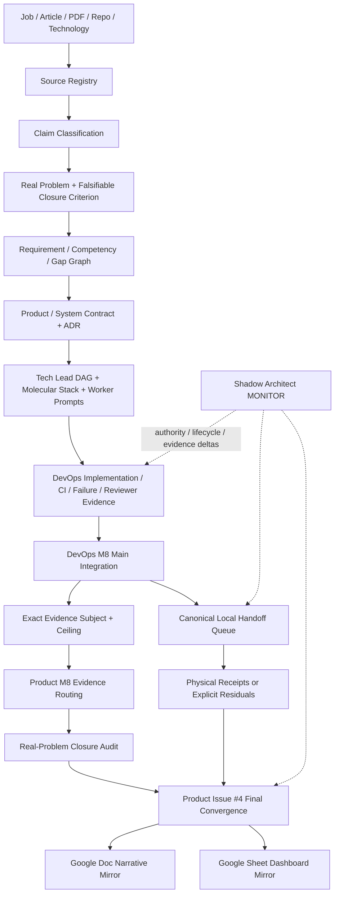

# Product Manager Notes

Public **Manager requirement, decision, and evidence-routing control plane** for the Full Manager MVP Demo.

This repository turns job descriptions, articles, PDFs, repositories, and technology candidates into a traceable Manager Evidence Graph. `ed3c/DevOps-Manager-Notes` owns executable evidence. `ed3c/skills-shared` owns reusable Tech Lead, Shadow Architect, Git Town, and Local Handoff procedures. Google Docs and Sheets are human projections only.

## Authority boundary

```text
skills-shared
  method / authority / DAG / handoff contracts
        ↓
Product-Manager-Notes
  source / requirement / decision / gap / interview routing
        ↓ exact public-safe evidence request
DevOps-Manager-Notes
  implementation / CI / failure / runtime contracts / receipts
        ↓ exact evidence subject + ceiling
Product-Manager-Notes
  competency admission / interview narrative / portfolio projection
```

GitHub is canonical. Google Doc, Google Sheet, issue prose, README prose, and UI views cannot promote evidence.

Repository visibility, permissions, force-push, release, production promotion or rollback, credential enrollment, semantic conflict resolution, and real-experience claims remain Human-owned. Read `docs/PUBLIC_DISCLOSURE_CHECKLIST.md` before public export.

## Current checkpoint

```text
M4 PUBLIC_MANAGER_ROUTING                         PASS_BOUNDED_AS_ROUTING
M8 PRODUCT_DURABLE_ROUTING_AND_PROBLEM_AUDIT     PASS_BOUNDED
```

M8 binds the Product control plane to the merged DevOps M8 public executable plane and adds a durable source-format-independent real-problem closure audit. It does **not** prove physical local execution, production adoption, employment tenure, or people-management tenure.

### Exact merged executable frontier

```text
DevOps repository       ed3c/DevOps-Manager-Notes
DevOps main              5d0c5db1626bf5c1a83334ea864b6a3eb7613df3
DevOps main tree         abd7fa38e9aa7ca720d9f110559a1f05b05c2023
DevOps milestone         PUBLIC_MAIN_INTEGRATION_AND_LOCAL_HANDOFF_READY

Local Handoff subject    e7b4e23799a3579572598ebd5864a80831d49db4
Local Handoff tree       0b72b9f09f73d3829db2f138d457a5691641bf79
Local Handoff rollback   bb940bf7d5a3b1f605b79e9fb8f33c463a8ee5a7
Active item              M8-LOCAL-REVIEWER-001
```

## Proof frontier

```text
Product requirements / architecture / ADR             PASS_BOUNDED
Product evidence audit and public disclosure           PASS_BOUNDED
DevOps remote implementation and main integration      PASS_BOUNDED
failure → recovery → postmortem → re-test drills       PASS_BOUNDED_AS_DRILL
public reviewer packet and evidence console            PASS_BOUNDED
canonical Local Handoff queue                          PASS_BOUNDED_AS_CONTRACT

local deterministic reviewer                           NOT_EXERCISED
live kind/Kubernetes application smoke                 NOT_EXERCISED
live advanced queue compilation                        NOT_EXERCISED
Argo controllers / Application reconciliation          NOT_EXERCISED
live Argo Rollouts canary                               NOT_EXERCISED
llama.cpp + exact model inference                      NOT_EXERCISED
synthetic 1,000-VU execution                           NOT_EXERCISED
registry-stored image signing                          NOT_EXERCISED
real production users / incidents / tenure             OUTSIDE_REPOSITORY_PROOF
formal TPM / people-management tenure                  HUMAN_ADMIT_REQUIRED
```

## Read order

```text
README.md
→ AGENTS.md
→ docs/PUBLIC_DISCLOSURE_CHECKLIST.md
→ docs/INDEX.md
→ docs/milestones/M8_MERGED_EVIDENCE_ROUTING.md
→ docs/audits/M8_REAL_PROBLEM_CLOSURE_AUDIT.md
→ registry/m8-merged-evidence-routing.json
→ registry/m8-real-problem-closure.json
→ registry/product-closure-matrix.yaml
→ registry/stack-plan.yaml
→ DevOps M8 README / Local Handoff queue
→ exact issue / PR / commit / Actions run / artifact / receipt
```

Historical M4 evidence remains available through `docs/milestones/PUBLIC_MANAGER_M4_ROUTING.md` and `registry/public-m4-manager-routing.json`.

## Cross-repository State Machine

```text
SOURCE_ADMITTED
→ CLAIM_CLASSIFIED
→ REAL_PROBLEM_CLASSIFIED
→ REQUIREMENT_GAP_BOUND
→ PRODUCT_SYSTEM_CONTRACT_ADMITTED
→ TECHNOLOGY_ADR_ADMITTED
→ DEVOPS_EVIDENCE_REQUESTED
→ REMOTE_EVIDENCE_BOUND
→ DEVOPS_MAIN_INTEGRATED                    current executable ceiling
→ LOCAL_HANDOFF_PENDING                     current physical frontier
→ LOCAL_REVIEWER_RUNNING
    ├─ FAIL → GAP_REOPENED
    └─ PASS → LIVE_KIND_UNBLOCKED
→ LIVE_KIND_RUNNING
    ├─ FAIL → GAP_REOPENED
    └─ PASS → ADVANCED_QUEUE_COMPILABLE
→ ARGO_CONTROLLERS
→ LOCAL_MODEL
→ SYNTHETIC_1000_VU
→ REGISTRY_SIGNING
→ PHYSICAL_EVIDENCE_BOUND
→ COMPETENCY_MATRIX_REVERIFIED
→ HUMAN_ADMIT_REQUIRED | INTERVIEW_PACKET_READY
```

A problem may be closed at `DESIGN_CLOSED` or `REMOTE_DETERMINISTIC_CLOSED` while remaining open at `LOCAL_PHYSICAL`, `PRODUCTION`, or `HUMAN_ADMIT` ceilings.

## Repository topology

```text
Product-Manager-Notes/
├── README.md
├── AGENTS.md
├── docs/
│   ├── INDEX.md
│   ├── PUBLIC_DISCLOSURE_CHECKLIST.md
│   ├── architecture/
│   ├── case-studies/
│   ├── evidence-audit/
│   ├── audits/
│   │   └── M8_REAL_PROBLEM_CLOSURE_AUDIT.md
│   └── milestones/
│       ├── PUBLIC_MANAGER_M4_ROUTING.md
│       └── M8_MERGED_EVIDENCE_ROUTING.md
├── roles/technical-product-manager/
│   ├── job-contract.yaml
│   ├── competency-matrix.yaml
│   ├── product/
│   ├── system-design/
│   ├── failures/
│   └── interviews/
├── registry/
│   ├── sources.yaml
│   ├── claims.yaml
│   ├── evidence.yaml
│   ├── gaps.yaml
│   ├── external-links.yaml
│   ├── public-m4-manager-routing.json
│   ├── m8-merged-evidence-routing.json
│   ├── m8-real-problem-closure.json
│   ├── product-closure-matrix.yaml
│   └── stack-plan.yaml
└── prompts/
    ├── README.md
    ├── stage-0-subject-authority.md ... stage-7-convergence-handoff.md
    └── full-mvp-devops-router.md
```

Path presence is not evidence.

## Directory → State Machine → DAG ownership

| Surface | State responsibility | Owner / route | Maximum evidence |
|---|---|---|---|
| `registry/sources.yaml` | source → stable identity | Product intake | source identity only |
| `registry/claims.yaml` | claim → type / owner / falsifier | Product intake | classification only |
| `docs/audits/` | source claim → real problem → closure criterion | Product M8 audit | design/routing audit |
| `roles/technical-product-manager/` | requirement → Product/System case → interview obligation | Product | named design/evidence ceiling |
| `registry/evidence.yaml` | exact subject → lane → verdict | evidence owner | named lane only |
| `registry/gaps.yaml` | missing proof → residual owner | Tech Lead | no capability proof |
| `registry/m8-merged-evidence-routing.json` | merged DevOps main → Product route | Product M8 | routing only |
| `registry/product-closure-matrix.yaml` | issue → close / keep-open reason | Tech Lead | workflow state only |
| `registry/stack-plan.yaml` | issue/PR → atom → Git/process relation | Tech Lead | orchestration only |
| `registry/external-links.yaml` | GitHub canonical → Google projection | Product #4 | URL reachability only |
| DevOps `handoff/local-handoff-queue.json` | physical predecessor order | DevOps #9 | queue contract only |

## Full data flow



## Molecular Stack index

```text
Product PR #5 bootstrap
└─ PR #8 Full Manager MVP contract
   └─ PR #11 public disclosure alignment
      └─ PR #12 public Manager M4 routing
           ↑ PR #9 TPM evidence audit                   exact side input
           ↑ DevOps PR #44 M4 reviewer                 external evidence

Merged Product follow-up
├─ PR #13 exact TPM evidence integration
├─ PR #15 real-problem audit integration attempt
├─ PR #17 Product issue closure matrix
└─ M8 durable routing/audit PR                          current convergence

Merged DevOps executable Stack
PR #68 M1–M7 backbone
├─ PR #37 Demo Console
├─ PR #38 Policy / Security / License
├─ PR #39 ML / LLMOps
├─ PR #40 Supply Chain / Fault
├─ PR #69 advanced runner contracts
└─ PR #70 M8 main integration / Local Handoff
```

Cross-repository evidence creates process/evidence edges, never fake Git ancestry.

## Issue closure

```text
Product bounded contracts complete:
  #1 #2 #3 #6 #7 #10 #12 #14

Product real-problem audit:
  #16 closes only after this durable M8 audit is merged and verified

Product final convergence:
  #4 KEEP_OPEN
```

Product #4 remains the sole final interview-evidence convergence owner until physical receipts and Human-admitted evidence are separately resolved.

## Local Handoff frontier

The current canonical DevOps queue is receipt-gated:

```text
M8-LOCAL-REVIEWER-001          ACTIVE
        ↓ real PASS receipt + trusted advancement
M8-LIVE-KIND-002               BLOCKED_BY_PREDECESSOR
        ↓ real PASS receipt + trusted advancement
M8-COMPILE-ADVANCED-QUEUE-003  BLOCKED_BY_PREDECESSOR
        ↓ canonical assertion + trusted advancement
Argo → Model → 1,000 VU → Registry Signing
```

Queue existence or compilation never equals queue execution. See the DevOps queue and `handoff/LOCAL_HANDOFF_EXECUTION_QUEUE.md` for exact commands and ceilings.

## Google / GitHub routing

- Google Sheet: `https://docs.google.com/spreadsheets/d/18W2xpge7ZgA4WHJd1wsbMOuC5vgCsskCwYeDYPG-twQ/edit`
- Google Doc: `https://docs.google.com/document/d/10qgxR5TxYiZG55cY9wN9ANrkmG_o32vBVrSdd45fgRM/edit`

A URL proves reachability only. Every projected claim must point back to an exact GitHub subject and preserve `NOT_EXERCISED`, `DRILL`, `OUTSIDE_REPOSITORY_PROOF`, and `HUMAN_ADMIT_REQUIRED` states.

## Forbidden promotions

```text
SOURCE_LINK             → COMPLETION_RECEIPT             forbidden
ISSUE_CLOSED            → CAPABILITY_PASS                forbidden
PR_MERGED               → PHYSICAL_RUNTIME_PASS          forbidden
FIXTURE_PASS            → LIVE_PREDECESSOR_PASS          forbidden
DRILL_COMPLETE          → PRODUCTION_INCIDENT_HISTORY    forbidden
LOCAL_K8S_PASS          → PRODUCTION_INFRA_EXPERIENCE    forbidden
1000_VU_PASS            → 1000_REAL_USERS                forbidden
LOCAL_MODEL_PASS        → PRODUCTION_LLM_TRAFFIC         forbidden
PORTFOLIO_IMPLEMENTED   → FORMAL_TPM_TENURE              forbidden
MANAGEMENT_DOCS         → PEOPLE_MANAGEMENT_TENURE       forbidden
```
