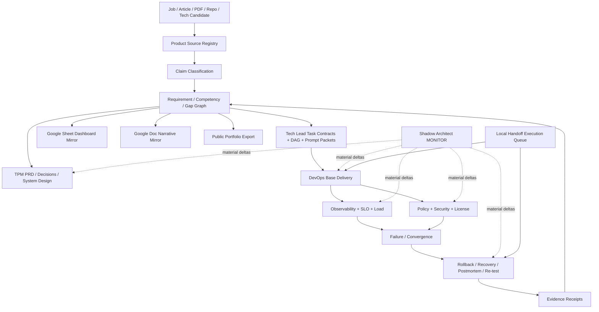

# Product Manager Notes

Private Technical Product Manager preparation, orchestration, and evidence-routing control plane.

This repository is the **management and routing center** for the Product/DevOps Manager evidence program. It turns job requirements, articles, PDFs, technical proposals, repository evidence, and technology candidates into a traceable Manager Evidence Graph. Material claims must route to a requirement, decision, implementation/evidence artifact, failure case, or explicit gap.

`DevOps-Manager-Notes` is the public executable evidence plane. `skills-shared` remains the reusable method plane. Google Docs and Sheets are human-readable projections, never canonical state.

## Control-plane ownership

```text
skills-shared
  reusable Tech Lead / Shadow Architect / Git Town / verification methods
       │ pinned method dependency
       ▼
Product-Manager-Notes                     ← canonical management/router center
  sources / requirements / gaps / prompts / stage DAG / evidence graph
       │ public-safe evidence requests
       ▼
DevOps-Manager-Notes                      ← executable public evidence plane
  CI/CD / Docker / Kubernetes / SLO / failure / recovery / receipts
       │ exact evidence subjects
       └─────────────────────────────────► Product-Manager-Notes

Google Sheet = dashboard mirror
Google Doc   = narrative mirror
Human        = merge / release / visibility / real-experience admission
```

No public repository may require private repository access to remain understandable. Repository visibility is a Human-owned boundary.

## Eight-stage execution program

The program uses two dependency classes: **start-readiness** and **completion-readiness**. A stage may begin with explicit unknowns before all predecessors are complete, but it cannot claim completion without its required receipts.

| Stage | State transition | Primary owner | Parallelizable work | Completion output |
|---|---|---|---|---|
| P0 Subject & authority bootstrap | `REQUEST_BOUND → SUBJECT_ADMITTED` | control-plane owner | no | exact repo/branch/issue, authority, evidence ceiling, read order |
| P1 Source & evidence intake | `SUBJECT_ADMITTED → CONTEXT_ADMITTED` | evidence workers | article/PDF, GitHub evidence, technology/license source verification | source/claim/evidence/gap registries |
| P2 Real-problem closure & System Design | `CONTEXT_ADMITTED → SYSTEM_CONTRACT_EXTRACTED` | TPM + DevOps architects | TPM product lane and DevOps reliability lane | PRD/case, invariants, state machines, failure matrix |
| P3 Technology & ADR admission | `SYSTEM_CONTRACT_EXTRACTED → ARCHITECTURE_ADMITTED` | architecture workers | runtime, observability, policy/security candidates | ADRs, license/commercial-use inventory, rejected alternatives |
| P4 Tech Lead DAG & Stack compilation | `ARCHITECTURE_ADMITTED → WORKERS_ADMITTED` | Tech Lead | task-packet compilation after contracts freeze | true dependency DAG, leases, molecular Stack plan, zero-context prompts |
| P5 Parallel implementation | `WORKERS_ADMITTED → FIRST_GREEN` | bounded Workers | path-disjoint implementation leaves | code/docs/tests, exact-head receipts, draft/open PRs |
| P6 Failure/recovery/runtime proof | `FIRST_GREEN → REVERIFIED` | Shadow + runtime owner | selected fault/load/policy probes | failure evidence, rollback/recovery, postmortem, same-failure re-test |
| P7 Convergence/export/handoff | `REVERIFIED → READY_FOR_HUMAN_ADMIT / INTERVIEW_READY` | one convergence owner | Google narrative/dashboard projection after canonical state exists | indexes, public-safe claims, Local Handoff residuals, Human Admit packet |

`FIRST_GREEN` is a mandatory Shadow checkpoint, never terminal closure.

## Canonical Manager state machine

```text
SOURCE_BOUND
→ REQUIREMENT_EXTRACTED
→ COMPETENCY_MAPPED
→ CASE_MODELED
→ DECISION_LOGGED
→ IMPLEMENTATION_EVIDENCE_LINKED
→ FAILURE_EXERCISED
→ CLOSURE_EVIDENCE_BOUND
→ INTERVIEW_READY

stale / contradicted / wrong-subject evidence
→ GAP_REOPENED
```

## Repository topology

```text
Product-Manager-Notes/
├── AGENTS.md
├── README.md
├── roles/
│   └── technical-product-manager/
│       ├── job-contract.yaml
│       ├── competency-matrix.yaml
│       ├── gap-analysis.md
│       ├── system-design/
│       ├── product/
│       ├── failures/
│       └── interviews/
├── registry/
│   ├── sources.yaml
│   ├── claims.yaml
│   ├── evidence.yaml
│   ├── external-links.yaml
│   ├── stack-plan.yaml
│   └── gaps.yaml
├── docs/
│   ├── INDEX.md
│   ├── architecture/
│   │   └── MANAGER_EVIDENCE_GRAPH.md
│   ├── decisions/
│   └── case-studies/
└── prompts/
    ├── README.md
    ├── stage-0-subject-authority.md
    ├── stage-1-source-evidence.md
    ├── stage-2-problem-closure-system-design.md
    ├── stage-3-technology-adr.md
    ├── stage-4-tech-lead-stack-plan.md
    ├── stage-5-parallel-implementation.md
    ├── stage-6-shadow-runtime-failure.md
    └── stage-7-convergence-handoff.md
```

Directories are introduced only with a real artifact. Path presence is not capability proof.

## Directory → State Machine → DAG ownership

| Directory / surface | State Machine responsibility | Consumes | Produces / next owner | Evidence ceiling |
|---|---|---|---|---|
| `roles/technical-product-manager/` | requirement → competency → interview readiness | admitted sources | requirement/case contracts → task DAG | source/design until evidence binds |
| `registry/sources.yaml` | source discovery → classification | URL/file/repo/job source | stable source IDs → claims | reachability/source only |
| `registry/claims.yaml` | claim → type → owner → falsifier | source IDs | requirements/assumptions/unknowns | classification only |
| `registry/evidence.yaml` | subject → evidence lane → verdict | exact receipts/artifacts | competency closure/gap reopen | named lane only |
| `registry/gaps.yaml` | missing proof → owner → next gate | requirements + evidence | issue/task packets | no capability proof |
| `registry/external-links.yaml` | canonical GitHub state → Google projection | admitted GitHub subjects | Doc/Sheet reachability | URL reachability only |
| `registry/stack-plan.yaml` | issue → molecular atom → branch relation → lease | Tech Lead task contracts | Git/PR topology | planning/publication state only |
| `docs/architecture/` | problem → invariant → state/DAG/data flow | requirements + evidence | system contract → implementation request | design/static reasoning |
| `prompts/` | stage contract → zero-context Worker packet | exact subject + stage state | separate-session execution packet | instruction only |
| GitHub Issues | unresolved obligation → acceptance contract | gap/stack node | work owner / Local Handoff pointer | workflow state only |
| Google Sheet / Doc | canonical state → human dashboard/narrative | GitHub IDs/URLs | readable mirror | never promotes evidence |

## End-to-end data flow



## Tech Lead task DAG

### Start-readiness

```text
PR #5 bootstrap contract
├── #1 evidence audit
├── #2 product/system-design drafting with unverified claims marked explicitly
├── #3 DRILL/SIMULATION failure-case drafting
└── #4 dashboard/narrative schema with canonical GitHub subjects
```

### Completion-readiness

```text
PR #5 bootstrap contract
→ #1 exact evidence audit
   ├──► #2 flagship product/system-design case
   └──► #3 failure/decision/postmortem library
        (#2 and #3 are path-disjoint sibling leaves after #1)
             └──────────┬──────────┘
                        ▼
               #4 convergence/index/export
```

An issue dependency does not automatically require Git ancestry. A true child branch exists only when it consumes the parent branch's **unmerged bytes or contracts**.

## Molecular Stack PR plan

The canonical machine-readable plan is `registry/stack-plan.yaml`. Until a branch/PR actually exists, its head remains `null`/`PLANNED`; documentation must not invent Git state.

```text
C0  PR #5  bootstrap evidence contract                       ROOT
  ↓
E1  #1     exact source/evidence audit                       TRUE_CHILD while C0 unmerged
  ├── D2   #2 product/system-design case                     SIBLING after E1
  └── E3   #3 failure/decision/postmortem drill library      SIBLING after E1
        └─────────────── verified side inputs ───────────────┐
                                                            ▼
X4  #4     Google/index/interview convergence                CONVERGENCE
```

Atom vocabulary follows `git-town-stacked-pr-worker`: `C` contract, `K` deterministic core, `A` adapter/substrate, `E` eval/fault control, `X` convergence/E2E, `D` docs/receipt/handoff. One convergence owner updates shared indexes after prerequisite evidence is stable.

## Separate ChatGPT session model

`prompts/` contains eight zero-context stage prompts. Every new session must bind:

```text
repo + branch + exact commit/tree + issue
goal / non-goals
allowed / read-only / forbidden paths
consumed / produced artifacts
start dependencies / completion dependencies
invariants + negative controls
evidence lane + ceiling
Shadow deltas and stop conditions
Local Handoff boundary
Human-owned transitions
next prompt/stage
```

A Worker must stop on subject drift, overlapping writer lease, semantic conflict, missing required evidence, unbounded side effect, or authority widening. Worker/LLM self-report is candidate evidence only.

## GitHub / Google boundary

GitHub is canonical for versioned requirements, decisions, issues, PRs, evidence status, Stack state, and traceability.

Current human-readable projections:

- Google Sheet dashboard: `https://docs.google.com/spreadsheets/d/18W2xpge7ZgA4WHJd1wsbMOuC5vgCsskCwYeDYPG-twQ/edit`
- Google Doc narrative index: `https://docs.google.com/document/d/10qgxR5TxYiZG55cY9wN9ANrkmG_o32vBVrSdd45fgRM/edit`

Their canonical routing records live in `registry/external-links.yaml`. A URL proves reachability only; it cannot promote `ABSENT`, `NOT_EXERCISED`, DRILL, local-runtime, or virtual-load evidence.

## Evidence policy

Use exact states:

```text
PASS
FAIL
ABSENT
NOT_IMPLEMENTED
NOT_EXERCISED
SKIPPED_BY_POLICY
HUMAN_ADMIT_REQUIRED
```

Evidence ladder:

```text
L0 SOURCE_CLAIM
L1 STATIC_REASONING
L2 DETERMINISTIC_TEST
L3 LOCAL_INTEGRATION
L4 REAL_SUBSTRATE
L5 ADVERSARIAL_OR_CHAOS
L6 PRODUCTION_OBSERVATION
```

A design document is not runtime proof. A local load test is not real organizational adoption. A simulated incident is always `DRILL` or `SIMULATION`.

## Shadow Architect monitor

Monitor material deltas in:

```text
ASSUMPTION
STATE
AUTHORITY
OWNERSHIP
LIFECYCLE
CONCURRENCY
RESOURCE
EXTERNAL_SIDE_EFFECT
FAILURE_SURFACE
EVIDENCE
```

At each material checkpoint ask:

1. What became newly possible?
2. What must now remain true?
3. How would we know it is false?

Use `L0 OBSERVE`, `L1 WARN`, `L2 REVIEW`, `L3 BLOCK`. Block unsafe/irreversible transitions, evidence laundering, secret/private-data exposure, visibility changes, or false experience/adoption claims.

## Local Handoff boundary

Remote GitHub/Google work continues in-session while the required evidence can be produced here. A Local Handoff Execution Queue is created only when proof requires a real local host/runtime/provider/forge that this session cannot exercise. Queue items bind:

```text
entry exact subject
→ required local capabilities
→ concrete argv/cwd/timeout
→ durable sanitized receipt
→ PASS exit condition
→ next item
```

Queue validation is not queue execution. Merge, release, promotion, repository visibility, semantic conflict resolution, and real-experience admission remain Human-owned.

## Current milestone

M0 bootstrap contracts exist in PR #5. The next evidence frontier is #1. #2 and #3 may draft in parallel only with unresolved claims explicit; they cannot close before #1 provides exact evidence subjects. #4 is the convergence owner after the Product and DevOps evidence graphs are reviewable.
